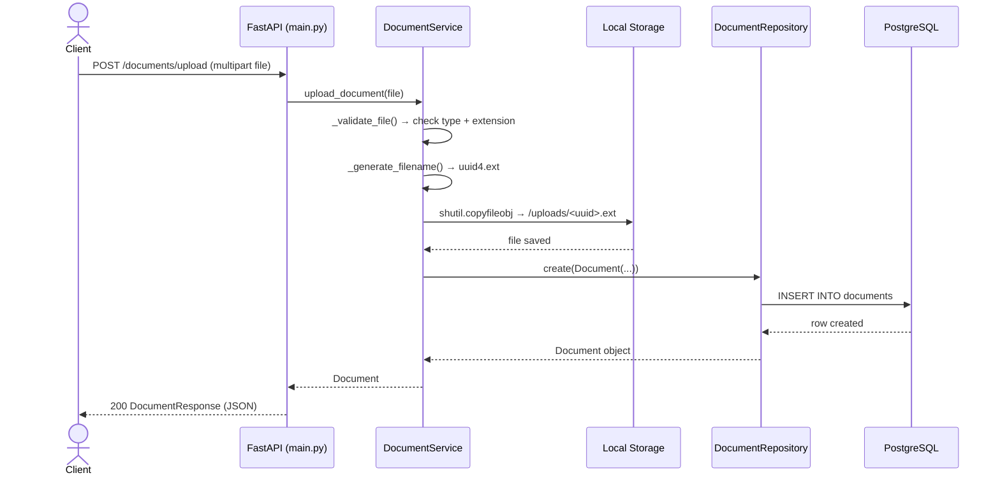
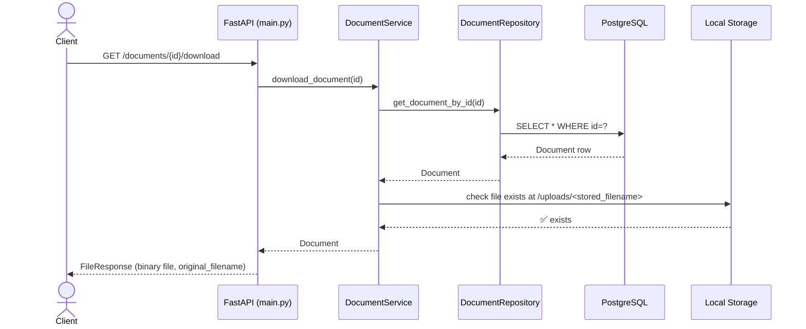
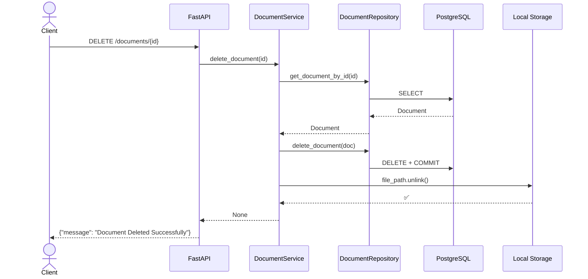

# 📄 Document Processing API — HLD & LLD

> Based on full source code inspection as of **Aug 1, 2026**. Reflects actual implemented code, not just planned docs.

---

# PART 1 — HIGH-LEVEL DESIGN (HLD)

---

## 1. System Overview

The **Document Processing API** is a RESTful backend service built with **FastAPI** that allows users to upload, store, retrieve, download, and delete documents. It is designed in a **layered clean architecture** with a roadmap toward JWT authentication, text extraction, search, and AI-powered analysis.

---

## 2. Architecture Style

**Layered Architecture** with strict separation of concerns:

```
┌─────────────────────────────────────┐
│           API Client                │
│  (Postman / Web App / Mobile)       │
└───────────────┬─────────────────────┘
                │  HTTP/HTTPS
                ▼
┌─────────────────────────────────────┐
│        Presentation Layer           │
│  FastAPI Routes  (app/main.py)      │
│  Pydantic Request/Response Models   │
└───────────────┬─────────────────────┘
                │
                ▼
┌─────────────────────────────────────┐
│         Service Layer               │
│  DocumentService                    │
│  (Business Logic + File Handling)   │
└───────────────┬─────────────────────┘
                │
       ┌────────┴────────┐
       ▼                 ▼
┌──────────────┐   ┌──────────────────┐
│  Repository  │   │  File Storage    │
│  Layer       │   │  (Local disk)    │
│  SQLAlchemy  │   │  /uploads/       │
└──────┬───────┘   └──────────────────┘
       │
       ▼
┌──────────────┐
│  PostgreSQL  │
│  (via        │
│  Alembic)    │
└──────────────┘
```

---

## 3. Component Breakdown

| Layer | Technology | Responsibility |
|---|---|---|
| **API / Presentation** | FastAPI, Pydantic | Route handling, request validation, response serialization |
| **Service** | Python | Business logic, file validation, UUID renaming, orchestration |
| **Repository** | SQLAlchemy ORM | DB CRUD — create, read, list, delete documents |
| **Database** | PostgreSQL | Persistent metadata storage |
| **File Storage** | Local filesystem (`/uploads/`) | Physical file storage (UUID-named) |
| **Config** | pydantic-settings + `.env` | Environment-based configuration |
| **Migrations** | Alembic | Schema versioning |

---

## 4. What's Currently LIVE vs. Planned

### ✅ Implemented
- Document Upload → file saved + metadata stored in DB
- Document List (paginated)
- Document Get by ID
- Document Delete (file + DB row)
- Document Download (`FileResponse`)
- SQLAlchemy ORM Model
- Alembic Migrations (2 versions)
- Dependency Injection chain

### ⏳ Planned (not yet implemented)
- JWT Authentication (`core/security.py` is empty)
- User Registration & Login (routes are stubs)
- Text Extraction (PDF/DOCX parsing)
- Search API (`search.py` is empty)
- Docker / docker-compose (files are empty)
- CI/CD (`.github/workflows/` is empty)
- Logging Middleware (empty)
- Tests (empty)

---

## 5. Request Flow (Current State)

```
Client
  │
  ▼
FastAPI Route (main.py)
  │
  ├─ Pydantic validates request params / body
  │
  ▼
Dependency Injection
  │  get_db() → SessionLocal → Session
  │  get_document_repository(db) → DocumentRepository
  │  get_document_service(repo) → DocumentService
  │
  ▼
DocumentService
  │  ├─ _validate_file()      → check content-type, extension
  │  ├─ _generate_filename()  → uuid4 + original extension
  │  └─ calls repository methods
  │
  ▼
DocumentRepository (SQLAlchemy)
  │
  ▼
PostgreSQL
```

---

## 6. Planned Auth Flow (not yet built)

```
POST /auth/login
  │
  ▼
AuthService.verify_credentials(email, password)
  │  → DB lookup by email
  │  → bcrypt.verify(password, password_hash)
  │
  ▼
core/security.py
  │  → create_access_token(sub=user_id, exp=30min)
  │  → returns signed JWT
  │
  ▼
Client stores JWT
  │
  ▼
Protected Route → Depends(get_current_user)
  │  → decode JWT → fetch user from DB
  │
  ▼
Access Granted
```

---

## 7. Database Design (ERD)

```
┌────────────────────────┐        ┌──────────────────────────┐
│       users            │        │       documents           │
│────────────────────────│        │──────────────────────────│
│ id (UUID, PK)          │◄───────│ id (INT, PK)             │
│ full_name VARCHAR(100) │ 1    N │ user_id (UUID, FK) [*]   │
│ email VARCHAR(255)     │        │ original_filename         │
│ password_hash TEXT     │        │ stored_filename (UUID)    │
│ is_active BOOLEAN      │        │ status VARCHAR(50)        │
│ created_at TIMESTAMP   │        │ created_at TIMESTAMP      │
│ updated_at TIMESTAMP   │        └──────────────────────────┘
└────────────────────────┘                  │ 1
                                            │
                                            │ 1
                                  ┌─────────▼────────────────┐
                                  │     extracted_text [*]    │
                                  │──────────────────────────│
                                  │ id (UUID, PK)             │
                                  │ document_id (FK)          │
                                  │ extracted_text TEXT        │
                                  │ page_count INT            │
                                  │ word_count INT            │
                                  │ processed_at TIMESTAMP    │
                                  └──────────────────────────┘

[*] = Planned, not yet implemented
```

### Currently Implemented Table: `documents`

| Column | Type | Notes |
|---|---|---|
| `id` | `INTEGER` PK | Auto-increment |
| `original_filename` | `VARCHAR(255)` | As uploaded by user |
| `stored_filename` | `VARCHAR(255)` | UUID-based, on disk |
| `status` | `VARCHAR(50)` | Default: `"uploaded"` |
| `created_at` | `TIMESTAMP TZ` | Server default `now()` |

> **Note:** Design doc calls for UUID PKs — current implementation uses INTEGER. `user_id` FK is not yet in schema.

---

## 8. File Storage Strategy

```
Upload Dir: /uploads/   (configurable via .env → UPLOAD_DIR)

Naming:     <uuid4>.<original_extension>
Example:    3f7a2b1c-...-9e4d.pdf

On Delete:  file.unlink() + DB row deleted (atomic attempt)
On Download: FileResponse(path, filename=original_filename)
```

---

## 9. Tech Stack

| Area | Tech |
|---|---|
| Language | Python 3.12+ |
| Framework | FastAPI |
| ORM | SQLAlchemy 2.x (mapped_column style) |
| DB | PostgreSQL |
| Migrations | Alembic |
| Validation | Pydantic v2 |
| Config | pydantic-settings |
| Testing | Pytest (configured, not written) |
| Linting | Ruff + pre-commit |

---

---

# PART 2 — LOW-LEVEL DESIGN (LLD)

---

## 1. Project Structure (Actual)

```
document-processing-api/
│
├── app/
│   ├── main.py                  ← All routes (monolith, not yet split)
│   ├── dependencies.py          ← DI factories for repo + service
│   │
│   ├── api/v1/                  ← EMPTY (future router split)
│   │   ├── auth.py              ← empty
│   │   ├── documents.py         ← empty
│   │   └── search.py            ← empty
│   │
│   ├── auth/                    ← EMPTY DIRECTORY
│   │
│   ├── core/
│   │   ├── config.py            ← Settings via pydantic-settings
│   │   ├── security.py          ← EMPTY (JWT planned)
│   │   └── logging.py           ← EMPTY
│   │
│   ├── db/
│   │   ├── base.py              ← DeclarativeBase + model imports
│   │   └── session.py           ← engine, SessionLocal, get_db()
│   │
│   ├── middleware/              ← EMPTY DIRECTORY
│   ├── dependencies/            ← EMPTY DIRECTORY
│   │
│   ├── models/
│   │   ├── __init__.py          ← exports Document
│   │   └── document.py          ← SQLAlchemy Document model
│   │
│   ├── repositories/
│   │   └── document_repository.py ← CRUD for documents table
│   │
│   ├── schemas/
│   │   ├── request_models.py    ← LoginRequest
│   │   └── response_models.py   ← DocumentResponse, DocumentListResponse, LoginResponse
│   │
│   ├── services/
│   │   └── document_service.py  ← upload, list, get, delete, download
│   │
│   ├── tests/                   ← EMPTY DIRECTORY
│   └── utils/                   ← EMPTY DIRECTORY
│
├── alembic/
│   └── versions/
│       ├── 1b9252ae01f9_crate_documents_table.py   ← v1
│       └── 15ec61f1b71c_update_document_schema.py  ← v2 (renamed cols)
│
├── requirements/                ← EMPTY DIRECTORY (no txt files!)
├── Dockerfile                   ← EMPTY
├── docker-compose.yml           ← EMPTY
├── pyproject.toml               ← Ruff, Black, Pytest config
└── .env                         ← DB URL, upload dir, allowed types
```

---

## 2. Implemented Endpoints

| Method | Path | Handler | Status |
|---|---|---|---|
| `GET` | `/` | `root()` | ✅ |
| `GET` | `/health` | `health()` | ✅ |
| `GET` | `/users` | `get_users(page, limit)` | ✅ (stub) |
| `GET` | `/users/{id}` | `get_user(id)` | ✅ (stub) |
| `POST` | `/login` | `login(LoginRequest)` | ⚠️ stub — always returns success |
| `POST` | `/documents/upload` | `upload_document(file)` | ✅ real |
| `GET` | `/documents` | `get_documents(page, limit)` | ✅ real |
| `GET` | `/documents/{id}` | `get_document_by_id(id)` | ✅ real |
| `DELETE` | `/documents/{id}` | `delete_document(id)` | ✅ real |
| `GET` | `/documents/{id}/download` | `download_document(id)` | ✅ real (latest) |

> ⚠️ No `/api/v1/` prefix yet — routes are not versioned in the actual URL.

---

## 3. Class / Module Breakdown

### `DocumentService` ([document_service.py](file:///c:/Users/ajaym/Downloads/document-processing-api/app/services/document_service.py))

```
DocumentService
│
├── __init__(repository: DocumentRepository)
│
├── _validate_file(file: UploadFile) → None
│   └── checks: content_type ∈ ALLOWED_CONTENT_TYPES
│               extension   ∈ ALLOWED_EXTENSIONS
│
├── _generate_filename(filename: str) → str
│   └── returns: f"{uuid4()}{extension}"
│
├── upload_document(file: UploadFile) → Document
│   ├── _validate_file(file)
│   ├── _generate_filename(file.filename)
│   ├── shutil.copyfileobj → disk
│   └── repository.create(Document(...))
│
├── get_documents(page, limit) → dict
│   └── repository.get_documents(offset, limit)
│       repository.get_all_documents() → total
│
├── get_document_by_id(document_id) → Document
│   └── repository.get_document_by_id(id) or 404
│
├── delete_document(document_id) → None
│   ├── get by id or 404
│   ├── repository.delete_document(doc)
│   └── file_path.unlink()
│
└── download_document(document_id) → Document
    ├── get by id or 404
    └── check file exists on disk or 404
```

> ⚠️ **Bug:** `delete_document` has an unreachable `except PermissionError` block after a bare `except Exception`.

---

### `DocumentRepository` ([document_repository.py](file:///c:/Users/ajaym/Downloads/document-processing-api/app/repositories/document_repository.py))

```
DocumentRepository
│
├── __init__(db: Session)
│
├── create(document: Document) → Document
│   └── db.add → commit → refresh → return
│
├── get_documents(offset, limit) → list[Document]
│   └── ORDER BY created_at DESC
│       .offset(offset).limit(limit).all()
│       ⚠️ Bug: .offset() called TWICE
│
├── get_all_documents() → int
│   └── db.query(Document).count()
│
├── get_document_by_id(document_id) → Document | None
│   └── .filter(Document.id == id).first()
│
└── delete_document(document: Document) → None
    └── db.delete(doc) → commit
```

---

### `Document` Model ([document.py](file:///c:/Users/ajaym/Downloads/document-processing-api/app/models/document.py))

```python
class Document(Base):
    __tablename__ = "documents"

    id: int  # PK, auto-increment
    original_filename: str  # VARCHAR(255), not null
    stored_filename: str  # VARCHAR(255), not null (UUID-based)
    status: str  # VARCHAR(50), default="uploaded"
    created_at: datetime  # TIMESTAMP TZ, server default now()
```

---

### Settings ([config.py](file:///c:/Users/ajaym/Downloads/document-processing-api/app/core/config.py))

```python
class Settings(BaseSettings):
    allowed_extentions: str  # ← typo: 'extentions'
    allowed_content_types: str
    database_url: str
    upload_dir: str
    model_config = SettingsConfigDict(env_file=".env")
```

> ⚠️ **Bug:** `document_service.py` calls `settings.ALLOWED_CONTENT_TYPE` and `settings.ALLOWED_EXTENSIONS` — wrong attribute names (case-sensitive + typo mismatch). Will cause `AttributeError` at runtime.

---

### Dependency Injection ([dependencies.py](file:///c:/Users/ajaym/Downloads/document-processing-api/app/dependencies.py))

```
FastAPI Request
    │
    ▼
get_db()
    └─ yields: Session (closes on exit)
    │
    ▼
get_document_repository(db=Depends(get_db))
    └─ returns: DocumentRepository(db)
    │
    ▼
get_document_service(repository=Depends(get_document_repository))
    └─ returns: DocumentService(repository)
```

---

## 4. Alembic Migration Chain

```
(base)
  │
  └── 1b9252ae01f9  "create documents table"  (Jul 30, 11:10)
        columns: id, filename, file_path, status, created_at
  │
  └── 15ec61f1b71c  "update document schema"  (Jul 30, 14:52)
        DROP: filename, file_path
        ADD:  original_filename, stored_filename
```

---

## 5. Pydantic Schemas

### Request

```python
LoginRequest:
    username: str  (min=3, max=20)
    password: str  (min=3, max=20)
```

### Response

```python
DocumentResponse:
    id:                int
    original_filename: str
    stored_filename:   str
    status:            str
    created_at:        datetime
    model_config = ConfigDict(from_attributes=True)  ← ORM mode

DocumentListResponse:
    documents: list[DocumentResponse]
    page:      int
    limit:     int
    total:     int

LoginResponse:
    username: str   ← ⚠️ Bug: route never returns this field
    message:  str
```

---

## 6. Sequence Diagrams

### Document Upload



---

### Document Download



---

### Document Delete



---

## 7. Known Bugs in Current Code

| # | File | Bug | Impact |
|---|---|---|---|
| 1 | [document_repository.py:27](file:///c:/Users/ajaym/Downloads/document-processing-api/app/repositories/document_repository.py#L27) | `.offset()` called twice | Wrong pagination, skips extra rows |
| 2 | [document_service.py:121](file:///c:/Users/ajaym/Downloads/document-processing-api/app/services/document_service.py#L121) | `except PermissionError` after bare `except Exception` | Dead code — never executes |
| 3 | [response_models.py:5](file:///c:/Users/ajaym/Downloads/document-processing-api/app/schemas/response_models.py#L5) | `LoginResponse` requires `username` field | `/login` route will fail Pydantic validation at runtime |
| 4 | [config.py](file:///c:/Users/ajaym/Downloads/document-processing-api/app/core/config.py) vs [document_service.py](file:///c:/Users/ajaym/Downloads/document-processing-api/app/services/document_service.py) | Attribute name mismatch: `allowed_extentions` vs `ALLOWED_EXTENSIONS` | `AttributeError` on first file upload |

---

## 8. What Needs to Be Built Next (Priority Order)

| Priority | Feature | Files to Create/Fill |
|---|---|---|
| 🔴 P0 | Fix the 4 bugs above | repo, service, schemas, config |
| 🔴 P0 | `requirements/base.txt` | List actual deps (FastAPI, SQLAlchemy, psycopg, etc.) |
| 🔴 P1 | JWT Auth | `core/security.py`, `app/auth/`, `models/user.py`, Alembic migration |
| 🟡 P1 | Split routes to `api/v1/` | `auth.py`, `documents.py`, `search.py` — move from `main.py` |
| 🟡 P2 | Text Extraction | New service + `extracted_text` table + `pdfplumber`/`python-docx` |
| 🟡 P2 | Search API | `search.py` + repository search query |
| 🟢 P3 | Tests | `app/tests/` — unit + integration with `pytest` + `httpx` |
| 🟢 P3 | Docker | `Dockerfile`, `docker-compose.yml` |
| 🟢 P3 | Logging | `core/logging.py` + middleware |
| 🟢 P4 | CI/CD | `.github/workflows/ci.yml` |
