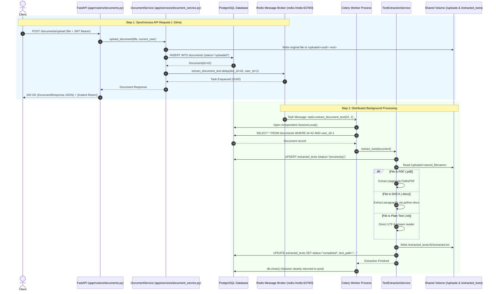
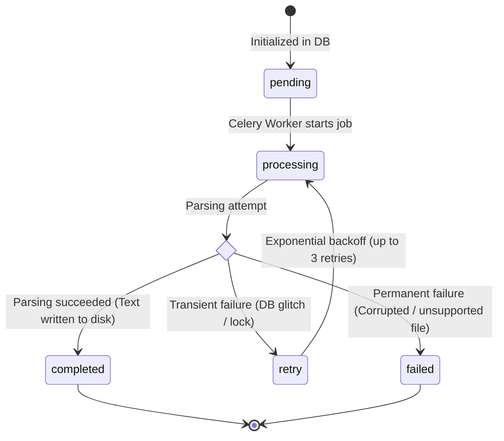

# 🚀 Pull Request: Distributed Asynchronous Document Processing with Celery & Redis

---

## 📌 1. Executive Summary

### What Problem Are We Solving?
Previously, document text extraction ran using FastAPI’s in-process `BackgroundTasks`. While functional for small prototypes, in-process execution has serious production limitations:
1. **API Resource Starvation**: Parsing multi-page PDFs (`PyMuPDF`) and Word documents (`python-docx`) is CPU-intensive. Running parsing on the API threadpool blocks incoming HTTP requests and degrades server response times.
2. **Crash & Task Loss Risk**: If the web server restarts or crashes during extraction, in-memory background tasks are lost forever.
3. **No Horizontal Scaling**: You cannot scale background workers independently from web API nodes.

### What Does This PR Do?
This PR transitions the text extraction pipeline to a **production-grade distributed task queue** powered by **Celery** (task manager & worker) and **Redis** (in-memory message broker). 

Now, when a document is uploaded:
1. FastAPI saves the file, inserts the database record, and publishes a lightweight job to **Redis** in under **~10ms**.
2. An isolated **Celery Worker** process asynchronously picks up the task from Redis, extracts the text, persists `extracted.txt` to disk, and updates PostgreSQL.

---

## 🏛️ 2. Architectural Overview: Before vs. After

### 🔴 Before: In-Process `BackgroundTasks`
```text
Client ──[ POST /upload ]──► FastAPI (API Container)
                               │
                               ├─► Save File + DB row
                               │
                               └─► [In-Memory Thread] Text Extraction (CPU Heavy! ⚠️)
                                        │
                                        ▼ (Blocks API event loop under heavy load)
```

---

### 🟢 After: Distributed Celery + Redis Queue
```text
Client ──[ POST /upload ]──► FastAPI (API Node)
                                │
                                ├─► Save File to disk (/uploads/)
                                ├─► INSERT Document in PostgreSQL
                                │
                                └─► Celery .delay(doc_id, user_id)
                                        │
                                        ▼ (Enqueue Job ~2ms)
                                 ┌──────────────┐
                                 │ Redis Broker │ (Port 6379)
                                 └──────┬───────┘
                                        │
                                        │ (Pulls Task)
                                        ▼
                                 ┌──────────────┐
                                 │Celery Worker │ (Dedicated Worker Node / Container)
                                 └──────┬───────┘
                                        │
                         ┌──────────────┴──────────────┐
                         ▼                             ▼
                 PostgreSQL DB                  Shared Filesystem
           (status: "completed")         (/extracted_texts/<id>/extracted.txt)
```

---

## 🔄 3. End-to-End Runtime Sequence Diagram



---

## 📂 4. Detailed Breakdown of Changes

| Layer | Files Modified / Added | Description |
|---|---|---|
| **Dependencies** | `pyproject.toml`, `requirements/base.txt`, `uv.lock` | Added `celery>=5.4.0` and `redis>=5.0.0`. |
| **Config** | `app/core/config.py`, `.env.example`, `.env` | Added `CELERY_BROKER_URL` and `CELERY_RESULT_BACKEND` with defaults. |
| **Celery Setup** | `app/core/celery_app.py` *(NEW)* | Instantiated Celery app instance configured with Redis broker and JSON serializer. |
| **Tasks** | `app/tasks/extraction_tasks.py` | Decorated `extract_document_text` with `@celery_app.task(...)` with retry policy. |
| **Service Layer** | `app/services/document_service.py` | Replaced `BackgroundTasks.add_task(...)` with `extract_document_text.delay(...)`. |
| **API Layer** | `app/routers/documents.py` | Cleaned up endpoint signature by removing unused `BackgroundTasks` injection. |
| **Infrastructure** | `docker-compose.yml`, `Makefile` | Added `redis` & `worker` container services with shared volume mounts; added `make worker`. |
| **Test Suite** | `tests/conftest.py`, `tests/test_extraction_tasks.py` *(NEW)* | Added Celery eager test mode (`task_always_eager=True`) and comprehensive task test coverage. |

---

## 🛡️ 5. Reliability & Failure Handling



1. **Automatic Retries**: Celery task is configured with `bind=True`, `max_retries=3`, and exponential backoff retry policies.
2. **Database Isolation**: Worker tasks create an isolated SQLAlchemy `SessionLocal()` per execution, preventing DB session leaks or collisions across concurrent worker threads.
3. **Graceful Status Tracking**: If an unrecoverable `TextExtractionError` happens, the database record is automatically flagged with `status="failed"`.

---

## 🧪 6. Testing & Quality Assurance

### Key Test Strategy
- In the test environment (`tests/conftest.py`), Celery is configured in **`task_always_eager=True`** mode.
- **Benefit**: Tasks run synchronously in-memory during tests, eliminating the need to have a running Redis instance in CI or during local `pytest` runs.

### Verification Commands & Results:
```bash
# 1. Run Linter & Formatter
uv run ruff check .
uv run ruff format --check .

# 2. Run Test Suite
uv run pytest -v
```

### ✅ Test Suite Results:
```text
tests/test_auth.py ....................                                 [ 60%]
tests/test_extracted_text_repository.py .....                           [ 75%]
tests/test_extraction_tasks.py ..                                       [ 81%]
tests/test_text_extraction_service.py ......                            [100%]

======================== 33 passed, 7 warnings in 2.81s ========================
```
- **Total Tests**: **33 Passed / 0 Failed (100% Success)**
- **Linting**: **0 errors / Clean formatting**

---

## 🚀 7. How to Run Locally

### Option A: Using Docker Compose (Full Stack)
```bash
# Build and spin up PostgreSQL, Redis, FastAPI, and Celery Worker
docker compose up --build
```

### Option B: Running Locally (Native)
```bash
# 1. Start Redis (via brew or docker)
brew services start redis   # or: docker run -p 6379:6379 redis:7-alpine

# 2. Run Celery Worker (Terminal 1)
make worker

# 3. Run FastAPI Web Server (Terminal 2)
make run
```

---

### 👥 Reviewer Checklist
- [x] Celery and Redis dependencies added to `pyproject.toml` and lockfile.
- [x] Celery broker URLs added to `.env.example` and `app/core/config.py`.
- [x] `extract_document_text.delay(...)` triggers without blocking HTTP responses.
- [x] Docker Compose includes `redis` and `worker` with shared storage volumes.
- [x] All 33 unit and integration tests pass cleanly.
