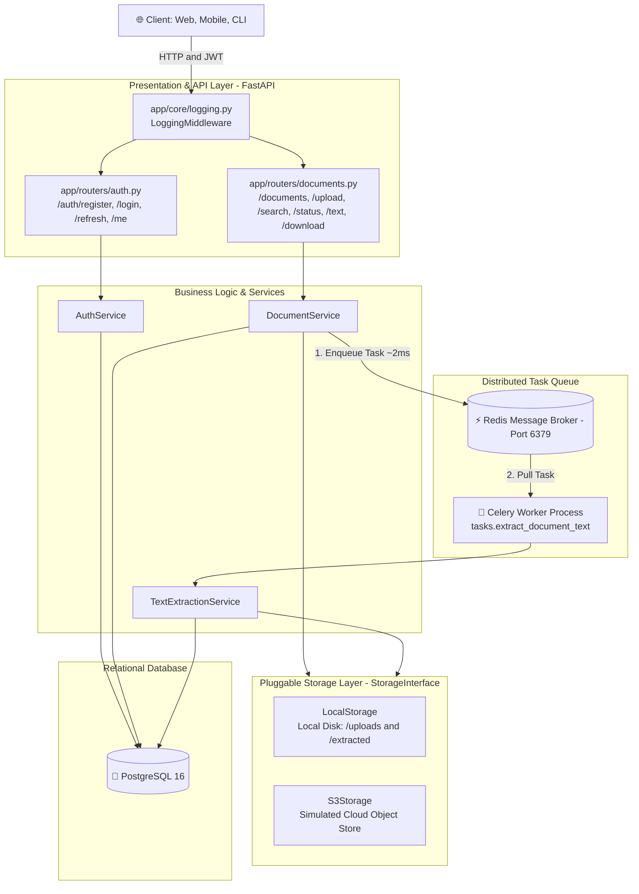
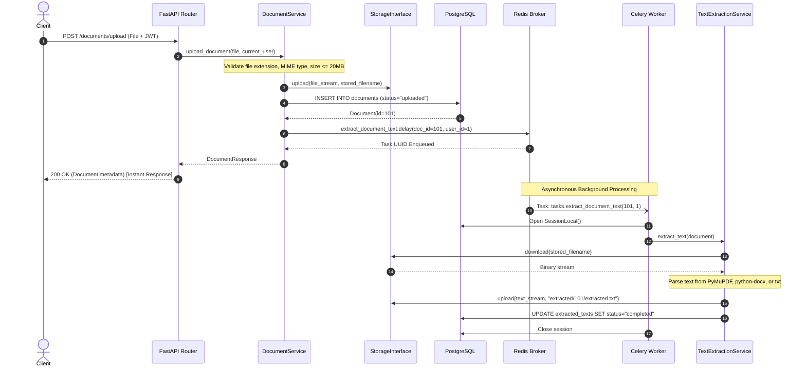
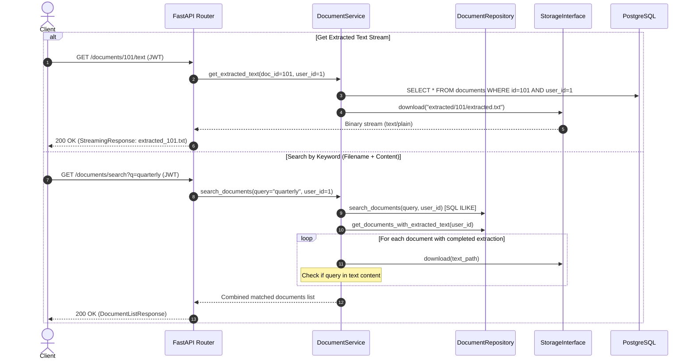

# 🚀 Pull Request: Stateless Storage Abstraction, Async Processing, Advanced Endpoints & CI/CD Pipeline

---

## 📌 1. Executive Summary

### What Problem Are We Solving?
Prior to this PR, the backend had several architectural bottlenecks and missing production requirements:
1. **Tight Coupling to Local Disk**: File reads and writes were hardcoded to the local container filesystem, preventing horizontal scaling across multiple instances or running in serverless/cloud environments (e.g., AWS S3).
2. **Missing Consumer Endpoints**: Although text extraction was performed in the background, there were no API endpoints for clients to monitor extraction progress (`/status`), stream extracted text (`/text`), or search across processed documents.
3. **Storage Leaks on Deletion**: Deleting a document removed the database record and original upload, but left the generated extracted text files orphaned in storage.
4. **Lack of File Size Guardrails**: Large files could be uploaded without payload limits, creating denial-of-service and disk exhaustion risks.
5. **No Automated CI/CD**: There was no continuous integration pipeline to guarantee code formatting, linting standards, and test suite execution on pull requests.

### What Does This PR Do?
This PR turns the Document Processing API into a **production-ready, horizontally scalable, storage-agnostic platform**:
- 🌐 **Pluggable Storage Abstraction**: Introduces an abstract `StorageInterface` with `LocalStorage` and in-memory cloud mock `S3Storage`. File operations in API routers, background workers, and services now use storage streams rather than local filesystem paths.
- ⚡ **Distributed Asynchronous Task Queue**: Celery workers backed by Redis handle all CPU-intensive PDF, DOCX, and TXT parsing off the main HTTP event loop.
- 🔍 **Search & Content Retrieval**: Adds `GET /documents/search?q=...` supporting both filename matching and full-text matching inside extracted text files. Adds `GET /documents/{id}/status` and streaming `GET /documents/{id}/text`.
- 🛡️ **Defensive Engineering & Leak Prevention**: Enforces a configurable 20MB file upload limit (`HTTP 413 Payload Too Large`) and ensures atomic deletion of both original uploads and extracted artifacts from storage.
- 👤 **Identity Profile Endpoints**: Adds `GET /auth/me` and `GET /users/me` returning current user metadata.
- 📊 **Structured Logging Middleware**: Measures and logs request latency and status codes for API observability.
- ⚙️ **GitHub Actions CI/CD**: Configured `.github/workflows/ci.yml` running linting (`ruff`), formatting checks, and automated tests (`pytest`) against PostgreSQL 16 and Redis 7 test containers.
- 🧪 **Comprehensive Test Coverage**: Expanded test suite to **45 tests** across unit, lifecycle integration, and chaos scenarios.

---

## 🏛️ 2. High-Level Architecture Diagram



---

## 🔄 3. End-to-End Sequence Diagrams

### A. Document Upload & Async Processing Flow



---

### B. Extracted Text Retrieval & Content Search Flow



---

## 📋 4. Key Endpoints Added & Updated

| Method | Endpoint | Auth | Description | Status Code |
| :--- | :--- | :---: | :--- | :---: |
| `GET` | `/auth/me` | Bearer | Retrieve current user profile (`id`, `username`, `email`, `created_at`) | `200 OK` |
| `GET` | `/users/me` | Bearer | User profile alias adhering to API specification | `200 OK` |
| `GET` | `/documents/search` | Bearer | Search documents by filename (`ILIKE`) and extracted text content | `200 OK` |
| `GET` | `/documents/{id}/status` | Bearer | Inspect document status and extraction progress (`pending`, `processing`, `completed`) | `200 OK` |
| `GET` | `/documents/{id}/text` | Bearer | Stream processed plain text directly from the storage provider | `200 OK` |
| `GET` | `/documents/{id}/download`| Bearer | Stream original uploaded file via `StorageInterface` | `200 OK` |
| `POST`| `/documents/upload` | Bearer | Upload document with 20MB validation (`HTTP 413` on oversize) | `200 OK` / `413` |
| `DELETE`| `/documents/{id}` | Bearer | Cascade delete DB records and purge both file and extracted text from storage | `200 OK` |

---

## 🛠️ 5. Changed Files Breakdown

```text
.github/
└── workflows/
    └── ci.yml                             # [NEW] GitHub Actions CI workflow (PostgreSQL + Redis + pytest + ruff)
app/
├── core/
│   ├── config.py                          # [MOD] Added max_file_size_bytes configuration
│   ├── logging.py                         # [MOD] Implemented LoggingMiddleware (latency & status logging)
│   └── storage/                           # [NEW] Storage abstraction package
│       ├── base.py                        # [NEW] StorageInterface ABC
│       ├── local.py                       # [NEW] LocalStorage filesystem provider
│       └── s3.py                          # [NEW] S3Storage in-memory mock provider
├── dependencies.py                        # [MOD] Added get_storage() dependency injection
├── main.py                                # [MOD] Attached LoggingMiddleware, added user_router
├── repositories/
│   └── document_repository.py             # [MOD] Added search_documents & get_documents_with_extracted_text
├── routers/
│   ├── auth.py                            # [MOD] Added /auth/me and /users/me endpoints
│   └── documents.py                       # [MOD] Added /search, /status, /text, storage streaming
├── schemas/
│   └── auth.py                            # [MOD] Added UserResponse schema
├── services/
│   ├── document_service.py                # [MOD] Enforce 20MB limit, storage cleanup on delete, content search
│   └── text_extraction_service.py         # [MOD] Converted to use StorageInterface and binary streams
└── tasks/
    └── extraction_tasks.py                # [MOD] Celery task updated to instantiate storage provider
tests/
├── conftest.py                            # [MOD] Added authenticated_user fixture
├── test_auth.py                           # [MOD] Added test coverage for /auth/me and /users/me
├── test_documents.py                      # [MOD] Unit tests for LocalStorage provider
├── test_documents_chaos.py                # [NEW] Edge case tests (storage 404s, cross-tenant isolation)
├── test_documents_integration.py          # [NEW] End-to-end lifecycle & search integration tests
├── test_extraction_tasks.py               # [MOD] Updated task test for storage paths
└── test_text_extraction_service.py        # [MOD] Complete update for stream extraction & storage
```

---

## 🧪 6. Testing & Quality Verification

### Test Suite Execution
All **45 tests** across unit, integration, and chaos suites pass without error:
```bash
uv run pytest
```
```text
tests/test_auth.py ......................                                [ 48%]
tests/test_documents.py ..                                               [ 53%]
tests/test_documents_chaos.py ...                                        [ 60%]
tests/test_documents_integration.py .....                                [ 71%]
tests/test_extracted_text_repository.py .....                            [ 82%]
tests/test_extraction_tasks.py ..                                        [ 86%]
tests/test_text_extraction_service.py ......                             [100%]

============================== 45 passed in 4.17s ==============================
```

### Static Analysis & Linting
```bash
uv run ruff check .
uv run ruff format --check .
```
```text
All checks passed!
60 files already formatted
```

---

## 🚢 7. Deployment & Migration Notes

- **Environment Variables**:
  - `MAX_FILE_SIZE_BYTES` (Optional): Overrides the default 20MB limit.
  - `STORAGE_PROVIDER` (Optional): `"local"` (default) or `"s3"`.
- **Database Migrations**: No schema alterations required; existing Alembic revisions cover all models.
- **Docker Compose**: Ready for deployment via `docker compose up --build`.
