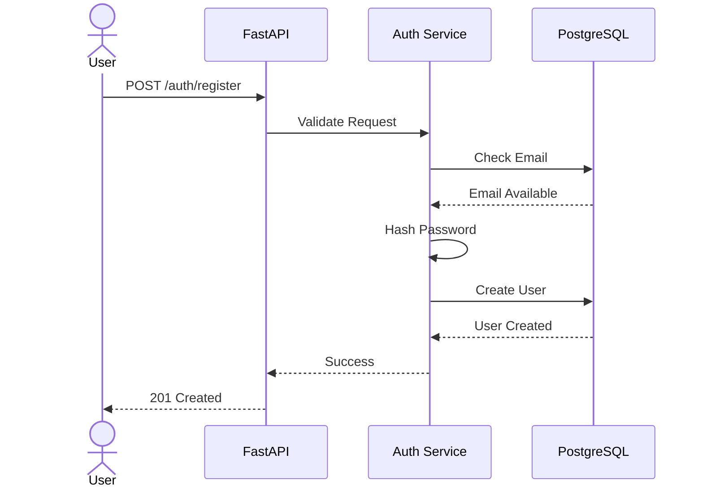
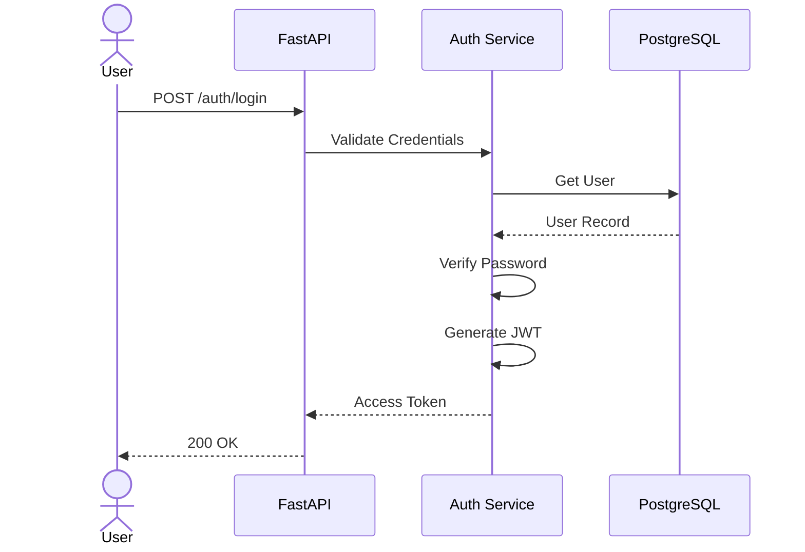
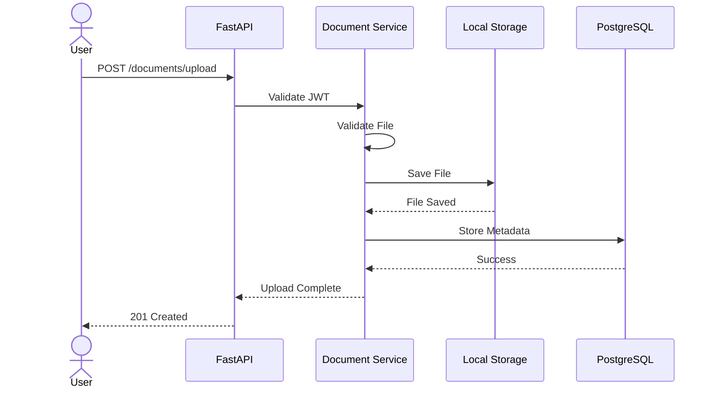
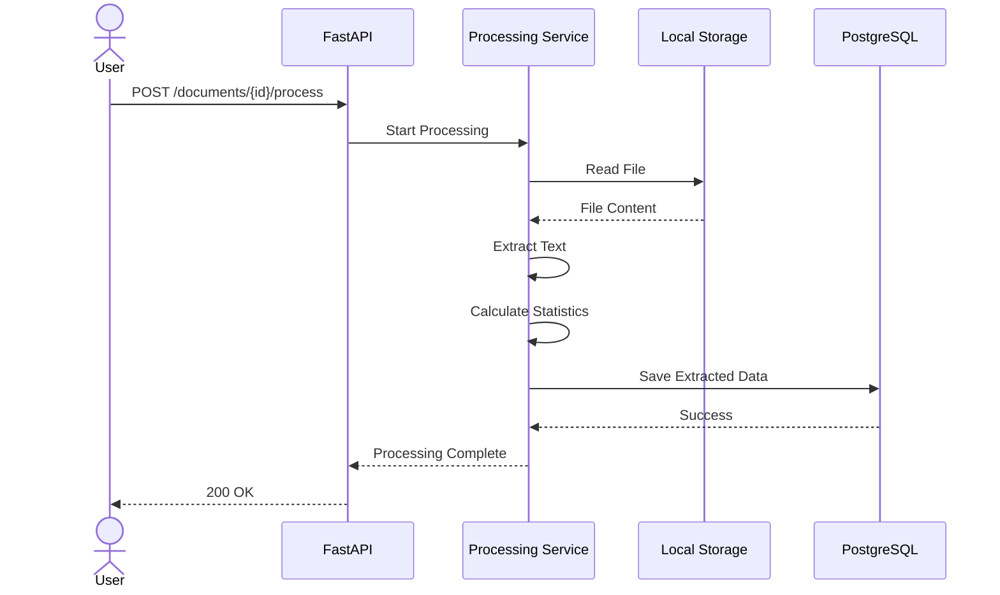
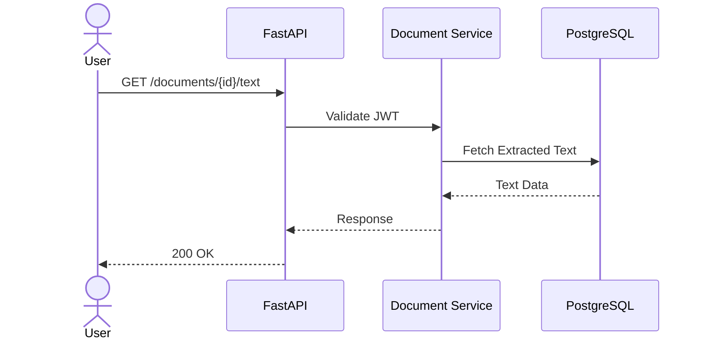
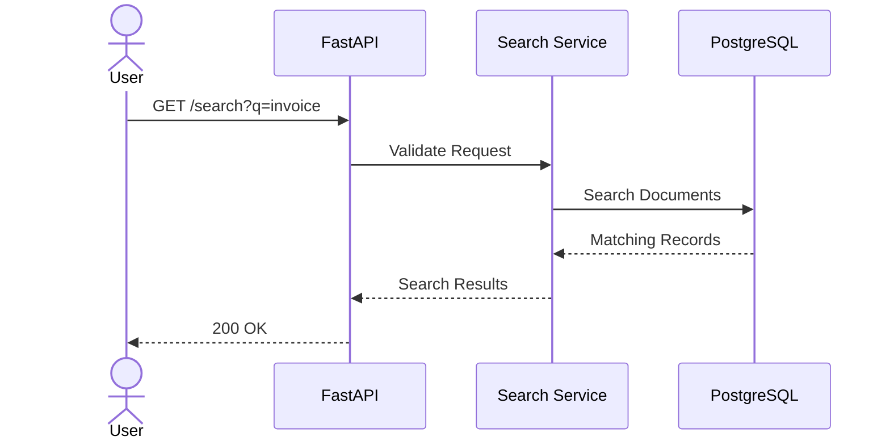
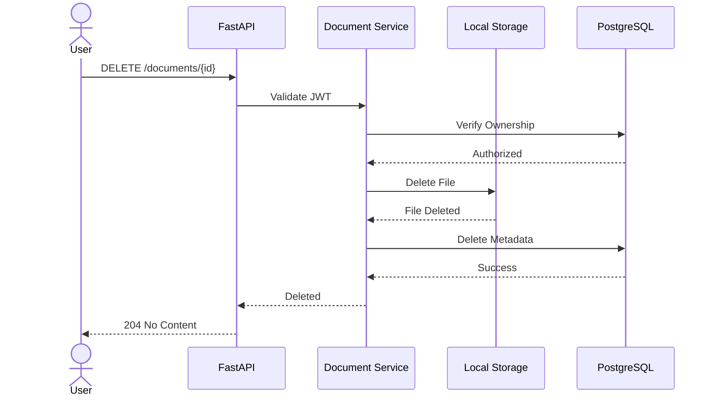

# Sequence Diagrams

**Project Name:** Document Processing API

**Version:** 1.0

**Status:** Draft

**Author:** Ajay Maida

**Last Updated:** July 2026

---

# Overview

This document describes the interaction flow between the client, API, services, database, and storage components using Mermaid sequence diagrams.

---

# 1. User Registration

---

# 2. User Login

---

# 3. Upload Document

---

# 4. Process Document

---

# 5. Retrieve Extracted Text

---

# 6. Search Documents

---

# 7. Delete Document

---

# Summary

The sequence diagrams describe the complete lifecycle of the application's core operations, including authentication, document upload, processing, retrieval, searching, and deletion. They serve as a reference for implementation, testing, and future enhancements.